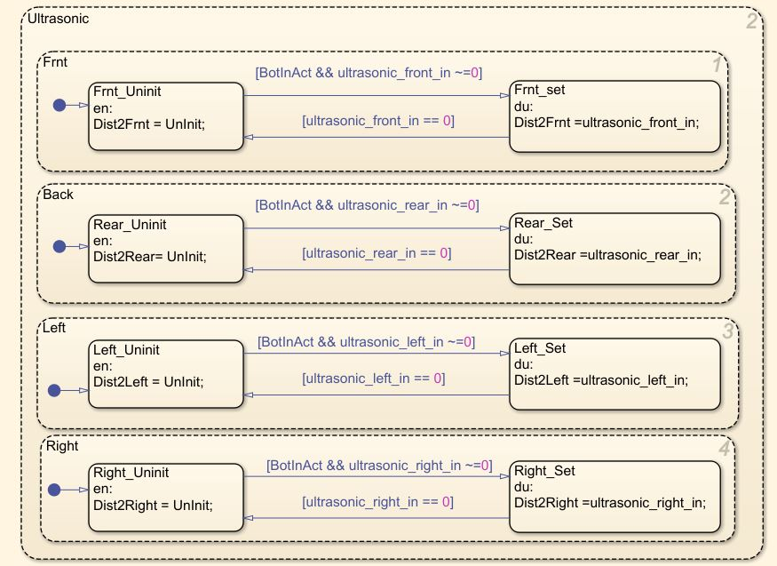
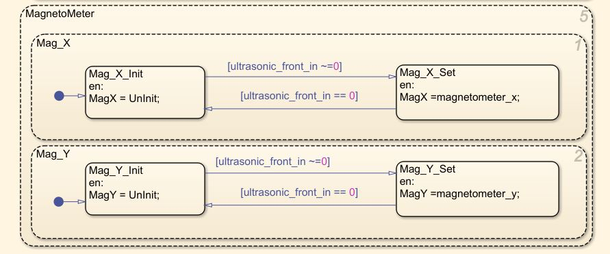
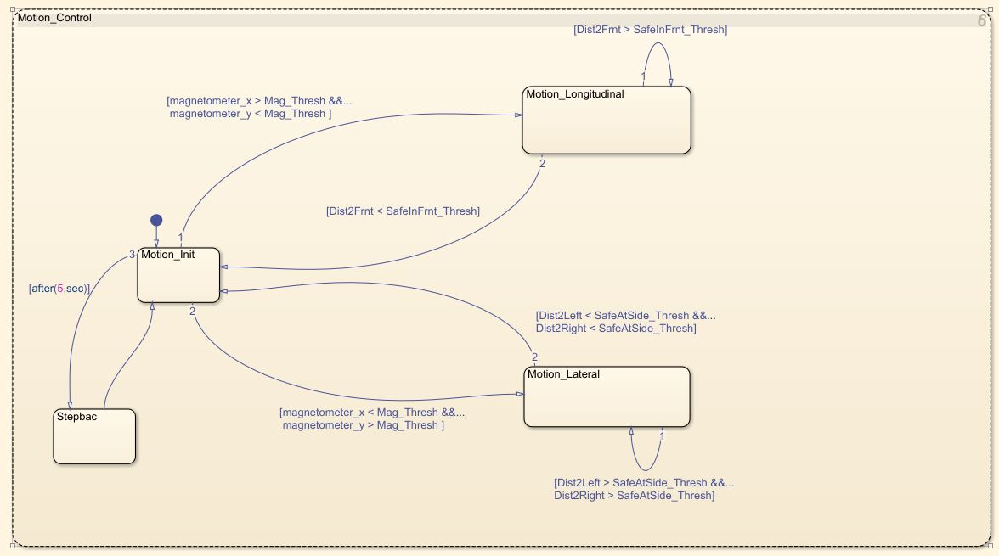

# Simulink-model
Implementation of an application scenario of surface area detection for robot using simulink model and state flow. 

Simulated the model to detect the surface area with the help of ultrasonic sensors data and to map the location with help of magnetometer data.

Model basicallly simulates the motion control of the Robot to detect the surface area around with help of scanner data from untrasonic sensor and magnatometer.

